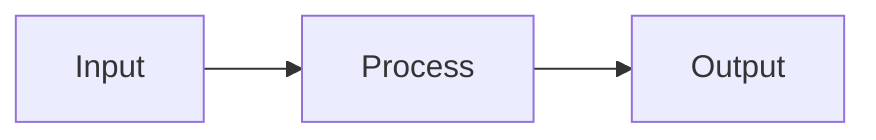
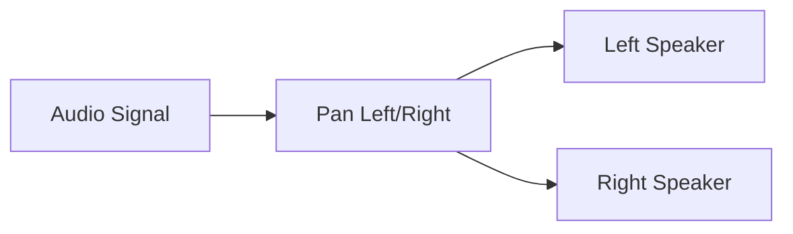
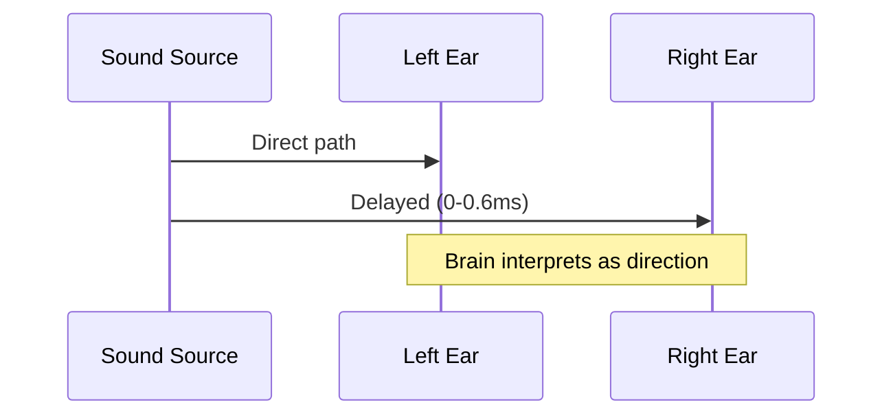

# TODO: Reveal.js Presentation Video Feature

## Overview

Add presentation video generation to podcast-ai that creates visual slide companions synced with podcast audio. Generate Reveal.js presentations from documents with AI-powered content, Mermaid diagrams, and audio synchronization.

**Vision**: `gencast lecture.md --with-slides` produces both audio podcast AND synced visual presentation.

**Status**: Future feature (research complete, ready for implementation)
**Estimated Effort**: 3-5 days for MVP
**Priority**: Enhancement (after core podcast features stable)

---

## Research Summary

### Official Reveal.js Built-in Plugins (6 core)

| Plugin | Purpose | File |
|--------|---------|------|
| **RevealMarkdown** | Write slides in Markdown | plugin/markdown/markdown.js |
| **RevealMath** | Render math equations (KaTeX/MathJax) | plugin/math/math.js |
| **RevealHighlight** | Syntax highlighted code | plugin/highlight/highlight.js |
| **RevealNotes** | Speaker notes in separate window (press S) | plugin/notes/notes.js |
| **RevealSearch** | Full-text search (Ctrl+Shift+F) | plugin/search/search.js |
| **RevealZoom** | Alt+click to zoom elements | plugin/zoom/zoom.js |

**Installation**:
```javascript
<script src="plugin/markdown/markdown.js"></script>
<script>
  Reveal.initialize({ plugins: [RevealMarkdown] });
</script>
```

**ES Module Support**: All plugins have `.esm.js` variants

### Community Plugins Ecosystem (80+)

#### Audio/Video Integration
- **Audio-Slideshow** (rajgoel): Audio playback, sync, recording, auto-advance
- **Embed Video**: Local media and live video embedding
- **TTS Basics**: Text-to-speech presentation narration
- **Handwriting**: Mouse/pen/touch handwriting input

#### Diagram & Visualization
- **reveal.js-mermaid-plugin** (zjffun): Mermaid diagrams (flowchart, sequence, class, ER, etc.)
  - Version: v11.6.0 (June 2025, actively maintained)
  - CDN: `https://cdn.jsdelivr.net/npm/reveal.js-mermaid-plugin@11.6.0/plugin/mermaid/mermaid.js`
  - Supports all Mermaid diagram types
  - Theme customization with `%%{init: ...}%%`
- **reveald3**: D3.js, Vega, Vega-lite, Semiotic visualizations
- **d3js-plugin**: Dynamic D3 visualizations with slide transitions
- **RevealVizScroll**: D3 scrollytelling-style visualizations
- **PlantUML**: UML, entity-relationship, technical diagrams
- **Mapbox-GL**: Interactive map slides

#### Markdown Tools & Converters
- **reveal-md**: "Reveal.js on steroids" - presentations from Markdown files
- **slidesdown**: "Slideshows as fast as you can type Markdown"
- **mdshow**: Quick markdown to presentation converter
- **GitPitch**: Instant presentations from markdown in Git repos
- **MkSlides**: Markdown to reveal.js, inspired by MkDocs

#### Export & Recording
- **decktape**: Command-line PDF export using Puppeteer
- **deck2pdf**: Deck to PDF conversion
- **PdfExport**: Screen/PDF export mode switcher

#### Interaction & Control
- **Chalkboard**: Drawing and annotation on slides
- **Spotlight**: Mouse position highlighting
- **Quizzes**: Interactive quiz functionality
- **Leap Motion**: Navigate with Leap Motion controller
- **Gamepad**: Use gamepad as remote
- **Wave**: Advance slides by waving at webcam
- **Speech**: Voice-controlled navigation

#### Navigation & UX
- **reveal.js-menu**: Slideout menu, theme switcher, TOC
- **reveal.js-simplemenu**: Simpler auto-generated menu
- **reveal.js-elapsed-time-bar**: Visual progress bar with timer
- **reveal-countdown**: Per-slide countdown timers

### Mermaid Integration Details

**Plugin**: zjffun/reveal.js-mermaid-plugin
**npm**: `reveal.js-mermaid-plugin` v11.6.0
**License**: MIT

**Configuration**:
```javascript
Reveal.initialize({
  mermaid: {
    theme: 'dark',
    themeVariables: { darkMode: true }
  },
  mermaidPlugin: {
    beforeRender(el) { /* custom logic */ },
    afterRender(el) { /* custom logic */ }
  },
  plugins: [RevealMermaid]
});
```

**HTML Structure**:
```html
<section>
  <div class="mermaid">
    <pre>
      %%{init: {'theme': 'dark'}}%%
      flowchart TD
        A[Start] --> B{Is it?}
        B -- Yes --> C[OK]
        B -- No --> D[End]
    </pre>
  </div>
</section>
```

**Supported Diagram Types**:
- Flowcharts / Graph diagrams
- Sequence diagrams
- Class diagrams
- State diagrams
- Entity Relationship diagrams
- User Journey diagrams
- Gantt charts
- Pie charts
- Requirement diagrams
- Gitgraph diagrams

**Theme Matching**: Configure Mermaid themes to match Reveal.js themes (black, white, sky, etc.)

### Video Generation Tools

#### Timecut (Virtual Time Approach)
**npm**: `timecut`
**Technology**: Puppeteer + FFmpeg + Virtual Time

**Features**:
- Frame-perfect capture with virtual time manipulation
- 60+ fps support
- Multiple output formats (MP4, WebM, AVI, MOV)
- Canvas capture mode for performance
- Pipe mode for direct FFmpeg streaming

**Usage**:
```bash
timecut "presentation.html" \
  --output=video.mp4 \
  --fps=30 \
  --duration=300 \
  --viewport="1920,1080"
```

**Node.js API**:
```javascript
const timecut = require('timecut');
await timecut({
  url: 'presentation.html',
  viewport: { width: 1920, height: 1080 },
  fps: 30,
  duration: 300,
  output: 'presentation.mp4'
});
```

**Limitation**: Only JS animations (not CSS transitions)

#### Puppeteer-Screen-Recorder (Real-time Capture)
**npm**: `puppeteer-screen-recorder`

**Features**:
- Chrome DevTools Protocol frame capture
- 60 fps recording
- Multiple formats (AVI, MP4, MOV, WebM)
- Headless and headful modes

**Usage**:
```javascript
const { PuppeteerScreenRecorder } = require('puppeteer-screen-recorder');
const recorder = new PuppeteerScreenRecorder(page, {
  fps: 30,
  videoFrame: { width: 1920, height: 1080 },
  videoCrf: 18,  // Quality (0-51, lower=better)
  videoCodec: 'libx264'
});
await recorder.start('./output.mp4');
// ... navigate slides ...
await recorder.stop();
```

**Limitation**: No audio capture

#### DeckTape (PDF Foundation)
**npm**: `decktape`

**Features**:
- PDF export for HTML presentations
- Individual slide screenshots
- Foundation for video workflows

**Usage**:
```bash
# PDF export
decktape reveal presentation.html presentation.pdf

# Screenshots for video pipeline
decktape reveal --screenshots --screenshots-directory=./frames presentation.html /dev/null
```

### Audio-Slide Synchronization Strategies

#### Strategy 1: Audio-Slideshow Plugin (Recommended)

**Plugin**: rajgoel/reveal.js-plugins/audio-slideshow

**Configuration**:
```javascript
audioSlideshow: {
  prefix: 'audio/',
  suffix: '.webm',
  advance: 0,              // Auto-advance immediately after audio
  autoplay: false,
  defaultDuration: 5,
  defaultPlaybackRate: 1.0,
  startAtFragment: false
}
```

**File Naming**:
- `audio/0.0.webm` - Slide 1
- `audio/1.0.webm` - Slide 2
- `audio/1.1.webm` - Slide 2, fragment 1
- `audio/2.0.webm` - Slide 3

**Custom Files**:
```html
<section data-audio-src="audio/intro.ogg">
  <!-- Slide content -->
</section>

<p class="fragment" data-audio-src="audio/detail.ogg">
  Fragment with audio
</p>
```

**Auto-Advance Control**:
```html
<!-- Wait 2 seconds after audio -->
<section data-audio-advance="2000">

<!-- Don't auto-advance -->
<section data-audio-advance="-1">
```

**Integration with Podcast-AI**:
1. Generate dialogue with `[SLIDE:N]` markers
2. Parse dialogue into per-slide segments
3. Generate audio for each segment using TTS
4. Save as `audio/N.0.webm` files
5. Configure Audio-Slideshow plugin

#### Strategy 2: SRT/VTT Timing Files

**Concept**: Parse subtitle timing to trigger slide changes

**SRT Format**:
```
1
00:00:00,000 --> 00:00:15,500
#slide-1

2
00:00:15,500 --> 00:00:32,000
#slide-2
```

**Implementation**:
```javascript
async function syncSlidesWithAudio(audioElement, srtPath) {
  const srt = await fetch(srtPath).then(r => r.text());
  const cues = parseSRT(srt);

  audioElement.addEventListener('timeupdate', () => {
    const currentTime = audioElement.currentTime;
    const activeCue = cues.find(c =>
      currentTime >= c.start && currentTime < c.end
    );

    if (activeCue && activeCue.text.startsWith('#slide-')) {
      const slideNum = parseInt(activeCue.text.replace('#slide-', ''));
      Reveal.slide(slideNum, 0);
    }
  });
}
```

#### Strategy 3: Timeline JSON

**Timeline Format**:
```json
{
  "slides": [
    { "id": 0, "duration": 15.5, "audioSegment": "intro" },
    { "id": 1, "duration": 16.5, "audioSegment": "concept1" },
    { "id": 2, "duration": 26.7, "audioSegment": "concept2" }
  ],
  "audioFile": "podcast.mp3"
}
```

**Implementation**:
```javascript
async function playPresentationWithTimeline(timeline) {
  const audio = new Audio(timeline.audioFile);
  audio.play();

  let elapsedTime = 0;
  for (const slide of timeline.slides) {
    setTimeout(() => {
      Reveal.slide(slide.id, 0);
    }, elapsedTime * 1000);
    elapsedTime += slide.duration;
  }
}
```

---

## Implementation Plan

### Phase 1: Core Slide Generation

**Create `src/slides.py`**:
```python
def generate_slides_markdown(
    text: str,
    model: str = "gpt-4o-mini",
    style: str = "academic",
    slide_count: int = None
) -> str:
    """
    Generate Reveal.js markdown from document text.

    Returns:
        Markdown with --- separators and Mermaid diagrams
    """
    # Calculate appropriate slide count
    if slide_count is None:
        slide_count = calculate_slide_count(len(text))

    # Load prompt template
    prompt = load_presentation_prompt(style)

    # Generate via OpenAI
    # Similar to dialogue.py pattern

    # Validate format (--- separators, no extra formatting)
    # Return cleaned markdown
```

**Functions**:
- `calculate_slide_count(input_length)` - Scale slides based on content
- `load_presentation_prompt(style)` - Load from presentation_prompts/
- `validate_slide_format(markdown)` - Ensure proper separators
- `generate_slides_markdown()` - Main generation function

**Slide Count Scaling**:
```python
def calculate_slide_count(input_length: int, scale_factor: float = 0.01) -> int:
    """
    Calculate appropriate number of slides.

    Default scale_factor=0.01 means ~1 slide per 100 chars.

    Examples:
    - 1000 chars → 10 slides
    - 5000 chars → 50 slides (capped at max)
    """
    min_slides = 5
    max_slides = 50

    scaled = int(input_length * scale_factor)
    return max(min_slides, min(scaled, max_slides))
```

### Phase 2: Presentation Prompt Templates

**Create `presentation_prompts/` directory**:

**`presentation_prompts/academic.txt`**:
```
You are a presentation designer. Convert educational content into Reveal.js markdown slides for academic presentations.

Guidelines:
- Create clear, structured slides suitable for lectures
- Use Mermaid diagrams for:
  * Processes → flowcharts
  * Workflows → sequence diagrams
  * Architecture → component diagrams
  * Data models → ER diagrams
- Include speaker notes with "Note:" prefix
- Progressive reveal for complex concepts using fragments
- One main concept per slide

CRITICAL FORMATTING RULES:
- Output ONLY Reveal.js markdown format
- Use --- for horizontal slides (new topics)
- Use ---- for vertical slides (subtopics)
- Include Mermaid diagrams in ```mermaid code blocks
- Add speaker notes after "Note:" on new line
- NO extra headers or formatting outside slide content
- Each slide starts with # or ## heading

Example:
# Introduction to Topic

Key points:
- Point 1
- Point 2

---

## Process Overview



Note: This diagram shows the basic workflow.

---

Generate {slide_count} slides covering the main concepts.
```

**`presentation_prompts/lecture.txt`**: Detailed explanations, more text per slide
**`presentation_prompts/conference.txt`**: Concise, visual-heavy, key takeaways

### Phase 3: HTML Generation with Plugins

**Create `generate_presentation_html()` function**:

```python
def generate_presentation_html(
    slides_markdown: str,
    title: str = "Presentation",
    theme: str = "black",
    audio_dir: str = "audio",
    enable_audio_sync: bool = True
) -> str:
    """
    Generate standalone Reveal.js HTML with all plugins via CDN.

    Returns:
        Complete HTML string ready to save as file
    """
    html_template = f"""<!DOCTYPE html>
<html lang="en">
<head>
  <meta charset="utf-8">
  <title>{title}</title>

  <!-- Reveal.js core -->
  <link rel="stylesheet" href="https://cdn.jsdelivr.net/npm/reveal.js@5.0.5/dist/reveal.css">
  <link rel="stylesheet" href="https://cdn.jsdelivr.net/npm/reveal.js@5.0.5/dist/theme/{theme}.css">

  <!-- Code highlighting -->
  <link rel="stylesheet" href="https://cdn.jsdelivr.net/npm/reveal.js@5.0.5/plugin/highlight/monokai.css">
</head>
<body>
  <div class="reveal">
    <div class="slides">
      <section data-markdown>
        <textarea data-template>
{slides_markdown}
        </textarea>
      </section>
    </div>
  </div>

  <!-- Reveal.js core -->
  <script src="https://cdn.jsdelivr.net/npm/reveal.js@5.0.5/dist/reveal.js"></script>

  <!-- Built-in plugins -->
  <script src="https://cdn.jsdelivr.net/npm/reveal.js@5.0.5/plugin/markdown/markdown.js"></script>
  <script src="https://cdn.jsdelivr.net/npm/reveal.js@5.0.5/plugin/highlight/highlight.js"></script>
  <script src="https://cdn.jsdelivr.net/npm/reveal.js@5.0.5/plugin/notes/notes.js"></script>
  <script src="https://cdn.jsdelivr.net/npm/reveal.js@5.0.5/plugin/math/math.js"></script>

  <!-- Mermaid plugin -->
  <script src="https://cdn.jsdelivr.net/npm/reveal.js-mermaid-plugin@11.6.0/plugin/mermaid/mermaid.js"></script>

  {"<!-- Audio slideshow plugin -->" if enable_audio_sync else ""}
  {"<script src='https://cdn.jsdelivr.net/npm/reveal.js-plugins@latest/audio-slideshow/plugin.js'></script>" if enable_audio_sync else ""}

  <script>
    Reveal.initialize({{
      controls: true,
      progress: true,
      center: true,
      hash: true,
      transition: 'slide',

      mermaid: {{
        theme: '{get_mermaid_theme(theme)}',
        themeVariables: {{ darkMode: {is_dark_theme(theme)} }}
      }},

      {"audioSlideshow: { prefix: '" + audio_dir + "/', suffix: '.webm', advance: 0, autoplay: false, defaultDuration: 5 }," if enable_audio_sync else ""}

      plugins: [
        RevealMarkdown,
        RevealHighlight,
        RevealNotes,
        RevealMath.KaTeX,
        RevealMermaid
        {", RevealAudioSlideshow" if enable_audio_sync else ""}
      ]
    }});
  </script>
</body>
</html>
"""
    return html_template
```

**Theme Mapping**:
```python
def get_mermaid_theme(reveal_theme: str) -> str:
    """Map Reveal.js theme to Mermaid theme."""
    dark_themes = ['black', 'night', 'league', 'blood']
    return 'dark' if reveal_theme in dark_themes else 'default'

def is_dark_theme(reveal_theme: str) -> str:
    dark_themes = ['black', 'night', 'league', 'blood']
    return 'true' if reveal_theme in dark_themes else 'false'
```

### Phase 4: Audio Segmentation

**Modify `src/audio.py`**:

```python
def generate_podcast_audio_segments(
    dialogue_text: str,
    slide_markers: List[int],  # Line numbers where [SLIDE:N] appears
    output_dir: str = "audio",
    host1_voice: str = DEFAULT_VOICES['HOST1'],
    host2_voice: str = DEFAULT_VOICES['HOST2'],
    spatial_separation: float = 0.4
) -> Dict[int, str]:
    """
    Generate separate audio files for each slide.

    Args:
        dialogue_text: Full dialogue with [SLIDE:N] markers
        slide_markers: List of dialogue line indices where slides change
        output_dir: Directory to save audio files

    Returns:
        Dict mapping slide numbers to audio file paths
        {0: "audio/0.0.webm", 1: "audio/1.0.webm", ...}
    """
    # Parse dialogue into segments
    segments = parse_dialogue(dialogue_text)

    # Group segments by slide
    slide_segments = group_segments_by_slide(segments, slide_markers)

    # Generate audio for each slide
    slide_audio_files = {}

    for slide_num, slide_segs in slide_segments.items():
        # Combine segments for this slide
        audio = AudioSegment.empty()

        for speaker, text in slide_segs:
            voice = voices.get(speaker)
            segment_audio = generate_speech(text, voice)
            segment_audio = apply_spatial_audio(segment_audio, positions[speaker])
            audio += segment_audio
            audio += AudioSegment.silent(duration=300)  # Pause between speakers

        # Export to audio/N.0.webm
        output_path = Path(output_dir) / f"{slide_num}.0.webm"
        output_path.parent.mkdir(parents=True, exist_ok=True)
        audio.export(str(output_path), format="webm", codec="libopus")

        slide_audio_files[slide_num] = str(output_path)

    return slide_audio_files
```

**Modify `src/dialogue.py`**:

Add slide marker detection:
```python
def add_slide_markers_to_dialogue(dialogue: str, slide_count: int) -> str:
    """
    Insert [SLIDE:N] markers into dialogue at appropriate intervals.

    Distributes markers evenly across dialogue length.
    """
    lines = dialogue.split('\n')
    markers_inserted = []

    lines_per_slide = len(lines) // slide_count

    for i in range(slide_count):
        marker_line = i * lines_per_slide
        if marker_line < len(lines):
            lines[marker_line] = f"[SLIDE:{i}] {lines[marker_line]}"
            markers_inserted.append(marker_line)

    return '\n'.join(lines), markers_inserted
```

### Phase 5: Video Generation (Optional)

**Create `src/video.py`**:

```python
import subprocess
from pathlib import Path

def generate_presentation_video(
    html_path: str,
    output_path: str,
    duration: int,  # Total duration in seconds
    fps: int = 30,
    width: int = 1920,
    height: int = 1080
) -> str:
    """
    Generate MP4 video from Reveal.js presentation using timecut.

    Requires: npm install -g timecut
    """
    cmd = [
        'timecut',
        html_path,
        '--output', output_path,
        '--fps', str(fps),
        '--duration', str(duration),
        '--viewport', f'{width},{height}'
    ]

    print(f"🎬 Generating video with timecut...")
    result = subprocess.run(cmd, capture_output=True, text=True)

    if result.returncode != 0:
        raise Exception(f"Video generation failed: {result.stderr}")

    print(f"✅ Video created: {output_path}")
    return output_path

def merge_video_with_audio(
    video_path: str,
    audio_path: str,
    output_path: str
) -> str:
    """
    Merge video and audio using FFmpeg.
    """
    cmd = [
        'ffmpeg',
        '-i', video_path,
        '-i', audio_path,
        '-c:v', 'copy',
        '-c:a', 'aac',
        '-shortest',
        output_path
    ]

    print(f"🎵 Merging video and audio...")
    result = subprocess.run(cmd, capture_output=True, text=True)

    if result.returncode != 0:
        raise Exception(f"Video merge failed: {result.stderr}")

    print(f"✅ Final video: {output_path}")
    return output_path
```

### Phase 6: CLI Integration

**Option A: Extend `gencast` command**:

Modify `podcast_ai.py`:
```python
parser.add_argument(
    '--with-slides',
    action='store_true',
    help='Generate Reveal.js presentation with audio sync'
)

parser.add_argument(
    '--slide-style',
    choices=['academic', 'lecture', 'conference'],
    default='academic',
    help='Presentation style'
)

parser.add_argument(
    '--slide-theme',
    choices=['black', 'white', 'league', 'sky', 'beige', 'night', 'serif', 'simple'],
    default='black',
    help='Reveal.js theme'
)

parser.add_argument(
    '--slides-only',
    action='store_true',
    help='Generate slides without audio'
)
```

**Workflow with `--with-slides`**:
```bash
gencast lecture.md --with-slides -o presentation.mp3

# Generates:
# - presentation.mp3 (full audio, optional)
# - presentation.html (Reveal.js slides)
# - audio/0.0.webm, audio/1.0.webm, ... (per-slide audio)
# - presentation.srt (subtitles)
```

**Option B: Separate `genslides` command**:

Create `presentation.py`:
```python
def main():
    parser = argparse.ArgumentParser(description='Generate Reveal.js presentations')
    parser.add_argument('input', nargs='+', help='Input files')
    parser.add_argument('-o', '--output', required=True, help='Output HTML file')
    parser.add_argument('--style', choices=['academic', 'lecture', 'conference'], default='academic')
    parser.add_argument('--theme', default='black', help='Reveal.js theme')
    parser.add_argument('--slides', type=int, help='Number of slides (auto if not specified)')
    parser.add_argument('--with-audio', action='store_true', help='Generate synced audio')
    parser.add_argument('--video', action='store_true', help='Generate MP4 video')

    args = parser.parse_args()

    # 1. Extract text
    text = extract_text(args.input)

    # 2. Generate slides markdown
    slides_md = generate_slides_markdown(text, args.style, args.slides)

    # 3. Generate HTML
    html = generate_presentation_html(slides_md, args.theme)

    # 4. Save HTML
    Path(args.output).write_text(html)

    # 5. Optional: Generate audio segments
    if args.with_audio:
        # Generate dialogue with slide markers
        dialogue = generate_dialogue(text)
        audio_files = generate_podcast_audio_segments(dialogue, ...)

    # 6. Optional: Generate video
    if args.video:
        generate_presentation_video(args.output, ...)
```

Add to `pyproject.toml`:
```toml
[project.scripts]
gencast = "podcast_ai:main"
genslides = "presentation:main"
```

---

## Architecture Summary

### File Structure
```
podcast-ai/
├── src/
│   ├── utils.py              # Document reading (reuse)
│   ├── dialogue.py           # Podcast dialogue (modify: add markers)
│   ├── audio.py              # Audio generation (modify: add segments)
│   ├── slides.py             # NEW: Slide generation
│   └── video.py              # NEW: Video generation (optional)
├── prompts/                  # Podcast prompts (existing)
├── presentation_prompts/     # NEW: Slide prompts
│   ├── academic.txt
│   ├── lecture.txt
│   └── conference.txt
├── podcast_ai.py             # Podcast CLI (modify or keep separate)
├── presentation.py           # NEW: Slides CLI (if separate command)
├── pyproject.toml            # Add genslides entry point
└── requirements.txt          # No new Python deps for basic feature
```

### Layer Separation
- **Data Layer** (`utils.py`): Extract text from documents
- **Business Logic**:
  - `slides.py`: Generate markdown
  - `dialogue.py`: Generate dialogue with markers
  - `audio.py`: Generate audio segments
  - `video.py`: Generate video
- **Interface** (`podcast_ai.py` or `presentation.py`): CLI orchestration

### Recommended Plugin Stack (CDN)

**Essential**:
1. **reveal.js** core (v5.0.5+)
2. **RevealMarkdown** (built-in) - Slide content
3. **RevealMath.KaTeX** (built-in) - Math equations
4. **RevealHighlight** (built-in) - Code syntax
5. **reveal.js-mermaid-plugin** (v11.6.0) - Diagrams
6. **Audio-Slideshow** (rajgoel) - Audio sync

**Optional**:
7. **RevealNotes** (built-in) - Speaker notes
8. **reveal.js-menu** (npm) - Navigation menu
9. **RevealSearch** (built-in) - Search functionality
10. **reveald3** - Advanced visualizations

All via CDN except reveal.js-menu (requires npm install or local file).

---

## Example Output

### Generated Markdown (slides.md)
```markdown
# Introduction to Spatial Audio

Creating immersive 3D sound experiences

---

## Key Techniques

Two main approaches:
- **Panning**: Volume-based positioning
- **ITD**: Interaural Time Difference

---

## How Panning Works



Note: Panning adjusts relative volume between left and right channels.

----

### Technical Implementation

```python
audio = audio.pan(position)  # -1 (left) to +1 (right)
```

---

## Interaural Time Difference



Note: ITD mimics how sound reaches ears at different times based on source direction.

---

## Benefits for Podcasts

- Reduces listener fatigue
- Creates natural conversation feel
- Distinguishes multiple speakers
- Enhances engagement

---

## Summary

Spatial audio = Panning + ITD

Implemented in podcast-ai for HOST1/HOST2 separation.
```

### Generated HTML (presentation.html)
```html
<!DOCTYPE html>
<html lang="en">
<head>
  <meta charset="utf-8">
  <title>Spatial Audio Presentation</title>

  <!-- Reveal.js core -->
  <link rel="stylesheet" href="https://cdn.jsdelivr.net/npm/reveal.js@5.0.5/dist/reveal.css">
  <link rel="stylesheet" href="https://cdn.jsdelivr.net/npm/reveal.js@5.0.5/dist/theme/black.css">
  <link rel="stylesheet" href="https://cdn.jsdelivr.net/npm/reveal.js@5.0.5/plugin/highlight/monokai.css">
</head>
<body>
  <div class="reveal">
    <div class="slides">
      <section data-markdown>
        <textarea data-template>
# Introduction to Spatial Audio
Creating immersive 3D sound experiences
---
## Key Techniques
Two main approaches:
- **Panning**: Volume-based positioning
- **ITD**: Interaural Time Difference
---
... (rest of slides)
        </textarea>
      </section>
    </div>
  </div>

  <script src="https://cdn.jsdelivr.net/npm/reveal.js@5.0.5/dist/reveal.js"></script>
  <script src="https://cdn.jsdelivr.net/npm/reveal.js@5.0.5/plugin/markdown/markdown.js"></script>
  <script src="https://cdn.jsdelivr.net/npm/reveal.js@5.0.5/plugin/highlight/highlight.js"></script>
  <script src="https://cdn.jsdelivr.net/npm/reveal.js@5.0.5/plugin/notes/notes.js"></script>
  <script src="https://cdn.jsdelivr.net/npm/reveal.js@5.0.5/plugin/math/math.js"></script>
  <script src="https://cdn.jsdelivr.net/npm/reveal.js-mermaid-plugin@11.6.0/plugin/mermaid/mermaid.js"></script>
  <script src="https://cdn.jsdelivr.net/npm/reveal.js-plugins@latest/audio-slideshow/plugin.js"></script>

  <script>
    Reveal.initialize({
      controls: true,
      progress: true,
      center: true,
      hash: true,
      transition: 'slide',

      mermaid: {
        theme: 'dark',
        themeVariables: { darkMode: true }
      },

      audioSlideshow: {
        prefix: 'audio/',
        suffix: '.webm',
        advance: 0,
        autoplay: false,
        defaultDuration: 5
      },

      plugins: [
        RevealMarkdown,
        RevealHighlight,
        RevealNotes,
        RevealMath.KaTeX,
        RevealMermaid,
        RevealAudioSlideshow
      ]
    });
  </script>
</body>
</html>
```

### Audio Files Structure
```
audio/
├── 0.0.webm   # Slide 1 (Introduction)
├── 1.0.webm   # Slide 2 (Key Techniques)
├── 2.0.webm   # Slide 3 (Panning diagram)
├── 2.1.webm   # Slide 3, fragment 1 (Code example)
├── 3.0.webm   # Slide 4 (ITD diagram)
├── 4.0.webm   # Slide 5 (Benefits)
└── 5.0.webm   # Slide 6 (Summary)
```

---

## Cost Estimates

### Per Presentation
- **Slide generation** (GPT-4o-mini): ~$0.01-0.05
  - Input: 1000-5000 chars
  - Output: 2000-8000 tokens (markdown)
- **Audio generation** (OpenAI TTS): ~$0.06-0.10
  - Same as podcast cost
  - 10-20 segments at $0.015 per 1000 chars
- **Subtitles** (Whisper): ~$0.01
- **Total**: ~$0.08-0.16 per presentation with audio

### Optional Video Generation
- **Video rendering** (timecut): Free (local processing)
- **FFmpeg merge**: Free (local processing)
- **Dependencies**: Node.js, timecut, FFmpeg

**Note**: No additional API costs for video, only compute time.

---

## Testing Strategy

### Phase 1: Basic Slide Generation
1. Create `test_slides_input.md` with 500 words
2. Test markdown generation: `generate_slides_markdown()`
3. Verify `---` separators, heading structure
4. Check for Mermaid diagrams if content warrants

### Phase 2: HTML Output
1. Generate HTML from test markdown
2. Open in browser, verify rendering
3. Check Mermaid diagrams display correctly
4. Test theme switching (black, white, sky)
5. Verify all CDN resources load

### Phase 3: Audio Sync
1. Generate dialogue with slide markers
2. Split into per-slide audio segments
3. Save as `audio/N.0.webm` files
4. Load presentation, test auto-advance
5. Verify audio plays for each slide

### Phase 4: Integration
1. Full end-to-end test: `gencast --with-slides test.md`
2. Verify all outputs created
3. Test in multiple browsers (Chrome, Firefox, Safari)
4. Check keyboard navigation (arrows, S for speaker notes)

### Phase 5: Video (Optional)
1. Install timecut: `npm install -g timecut`
2. Generate video from presentation
3. Verify smooth playback
4. Test audio merge with FFmpeg
5. Check final video quality

---

## Dependencies

### Python (No New Requirements)
- `openai>=1.0.0` (existing)
- `pydub>=0.25.1` (existing)
- `rich>=13.0.0` (existing)

**All slide/HTML generation uses existing dependencies.**

### Optional (Video Generation)
- **Node.js** (18.x+) for timecut
- **timecut** (npm): `npm install -g timecut`
- **FFmpeg**: System package

**Installation**:
```bash
# Node.js (if not installed)
# Fedora
sudo dnf install nodejs

# timecut
npm install -g timecut

# FFmpeg (usually pre-installed on Linux)
sudo dnf install ffmpeg
```

---

## Success Criteria

- [ ] Generate Reveal.js markdown from any document (MD, TXT, PDF)
- [ ] Output valid HTML that opens in browser
- [ ] Mermaid diagrams render correctly
- [ ] Math equations display properly (if in content)
- [ ] Code syntax highlighting works
- [ ] Audio-Slideshow plugin loads and plays audio
- [ ] Auto-advance progresses slides after audio
- [ ] Speaker notes accessible (press S)
- [ ] Navigation works (arrows, space, click)
- [ ] Themes apply correctly (black, white, sky, etc.)
- [ ] HTML is standalone (all assets via CDN)
- [ ] No console errors in browser

### Optional Success Criteria (Video)
- [ ] Video generates without errors
- [ ] Video includes all slides
- [ ] Audio syncs correctly with slides
- [ ] Output quality is suitable for sharing (1080p, 30fps)

---

## Future Enhancements

### Short-term
- [ ] Fragment-level audio (progressive reveal sync)
- [ ] Custom CSS themes (beyond built-in)
- [ ] Configurable transition styles per slide
- [ ] PDF export integration (via decktape)
- [ ] Speaker notes auto-generation

### Medium-term
- [ ] Multi-language support (i18n)
- [ ] Template gallery for different disciplines
- [ ] Auto-image generation (Together AI) for visual slides
- [ ] Interactive elements (polls, quizzes via plugins)
- [ ] Chart.js integration for data visualization
- [ ] D3.js advanced visualizations (reveald3 plugin)

### Long-term
- [ ] Real-time presentation editing GUI
- [ ] Collaborative slide editing
- [ ] Live streaming integration
- [ ] AI-powered slide design suggestions
- [ ] Accessibility enhancements (ARIA, alt text)
- [ ] Mobile-optimized viewer
- [ ] Analytics (slide dwell time, engagement)

---

## Research References

### Official Documentation
- Reveal.js docs: https://revealjs.com/
- Reveal.js plugins: https://revealjs.com/plugins/
- Mermaid docs: https://mermaid.js.org/

### Community Resources
- Reveal.js wiki (plugins): https://github.com/hakimel/reveal.js/wiki/Plugins,-Tools-and-Hardware
- rajgoel plugins collection: https://github.com/rajgoel/reveal.js-plugins
- reveal.js-mermaid-plugin: https://github.com/zjffun/reveal.js-mermaid-plugin

### Video Generation
- timecut: https://github.com/tungs/timecut
- puppeteer-screen-recorder: https://github.com/prasanaworld/puppeteer-screen-recorder
- decktape: https://github.com/astefanutti/decktape

### Inspiration
- reveal-md: https://github.com/webpro/reveal-md
- Slides.com: https://slides.com/ (official editor)
- RISE (Jupyter): https://rise.readthedocs.io/

---

## Implementation Priority

**Status**: Future feature (not started)
**Estimated Effort**: 3-5 days for MVP
**Phases**:
1. Core slide generation (1 day)
2. HTML output with plugins (1 day)
3. Audio segmentation (1 day)
4. CLI integration (0.5 day)
5. Testing & refinement (0.5-1 day)
6. Video generation (optional, +1-2 days)

**Dependencies**: None (can start anytime after podcast features stable)

**Recommended Start**: After podcast-ai v0.2.0 release

---

**Created**: 2025-11-14
**Last Updated**: 2025-11-14
**Assigned To**: Mae Capacite (C21348423)
**Project**: podcast-ai (gencast)
